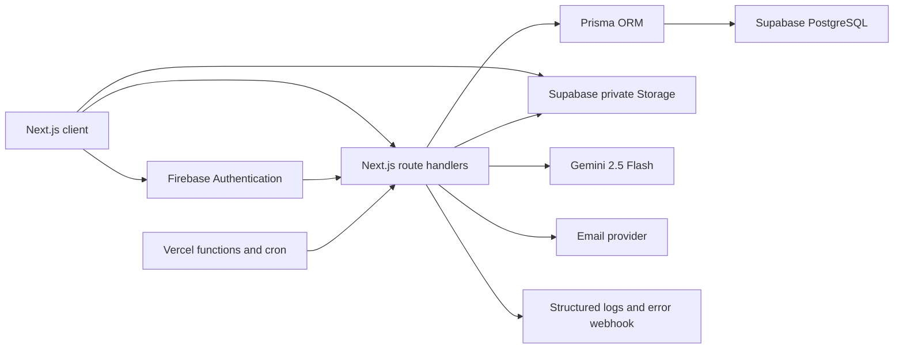

# HRFlow AI Architecture

## Identity and tenancy

Firebase is the identity provider. The server verifies ID tokens or revocable session
cookies, then resolves the Firebase UID to an internal UUID user. Every business query is
scoped by `organization_id`. Firebase custom claims let Supabase RLS resolve the same user,
organization, and role for browser Storage access.

## Data

Prisma owns application schema and migrations. PostgreSQL foreign keys preserve
relationships, while RLS provides defense in depth for direct Supabase access. Private
document paths begin with the organization UUID.

## AI

The reusable Gemini service validates structured output, rate limits requests, caches safe
responses, records redacted audit data, and supplies organization-scoped HR context.

## Operations

Vercel hosts the Next.js application and scheduled jobs. Public and protected health routes,
request IDs, structured logging, audit logs, security headers, dependency scanning, unit
coverage, and Playwright tests form the release controls.
